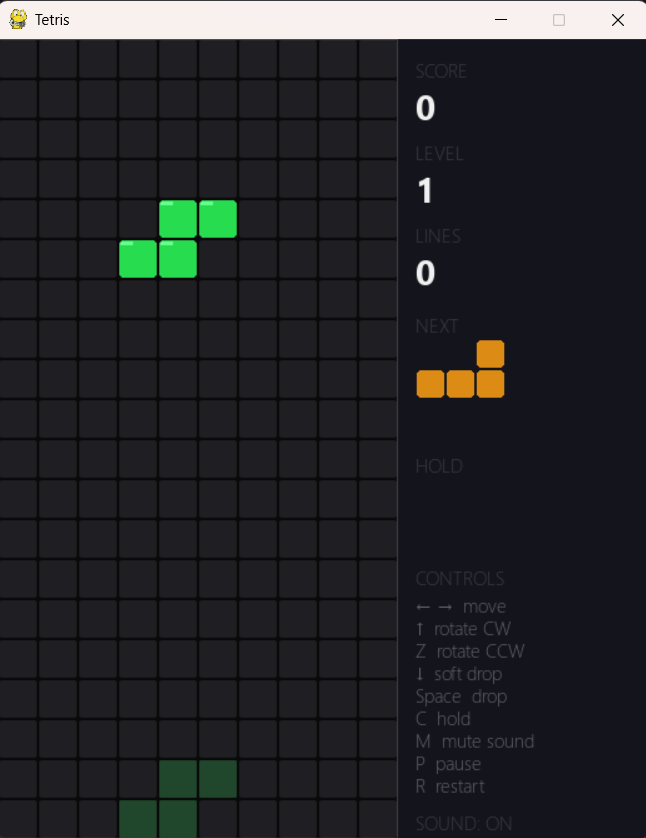

# Tetris (Python / Pygame)

A clean, single-file implementation of Tetris built with [Pygame](https://www.pygame.org/). Features standard 7-piece shapes, wall kicks, ghost piece preview, hold, next-piece preview, scoring, leveling, and pause/restart support.

<p align="center">
    
</p>

## Features

- **All 7 tetrominoes** (I, O, T, S, Z, J, L) with accurate rotation states
- **Ghost piece** showing where the current piece will land
- **Hold** a piece for later (with swap support)
- **Next piece** preview
- **Wall kicks** on rotation (simple kick table)
- **Scoring system** based on lines cleared and current level
- **Progressive difficulty** — drop speed increases as you level up
- **Pause** and **restart** support
- **Sidebar HUD** showing score, level, lines cleared, hold/next pieces, and controls

## Requirements

- Python 3.8+
- [Pygame](https://www.pygame.org/) 2.x

## Installation

```bash
git clone <your-repo-url>
cd <your-repo-directory>
pip install pygame
```

## Usage

Run the game with:

```bash
python main.py
```

## Controls

| Key           | Action           |
|---------------|------------------|
| `←` / `→`     | Move left / right |
| `↑`           | Rotate clockwise |
| `Z`           | Rotate counter-clockwise |
| `↓`           | Soft drop |
| `Space`       | Hard drop |
| `C`           | Hold piece |
| `P`           | Pause / resume |
| `R`           | Restart |

## Scoring

| Lines cleared | Points (× level) |
|----------------|------------------|
| 1              | 100 |
| 2              | 300 |
| 3              | 500 |
| 4 (Tetris)     | 800 |

Soft dropping and hard dropping also award small bonus points per cell traveled. Your level increases every 10 lines cleared, which increases drop speed.

## Project Structure

```
.
├── main.py            # Game logic, rendering, and main loop
├── README.md
├── CONTRIBUTING.md
└── CODE_OF_CONDUCT.md
```

## Contributing

Contributions are welcome! Please see [CONTRIBUTING.md](CONTRIBUTING.md) for guidelines on how to get started.

## Code of Conduct

This project follows a [Code of Conduct](CODE_OF_CONDUCT.md) to ensure a welcoming environment for all contributors.

## License

This project is currently unlicensed. Add a `LICENSE` file to specify how others may use, modify, or distribute this code.